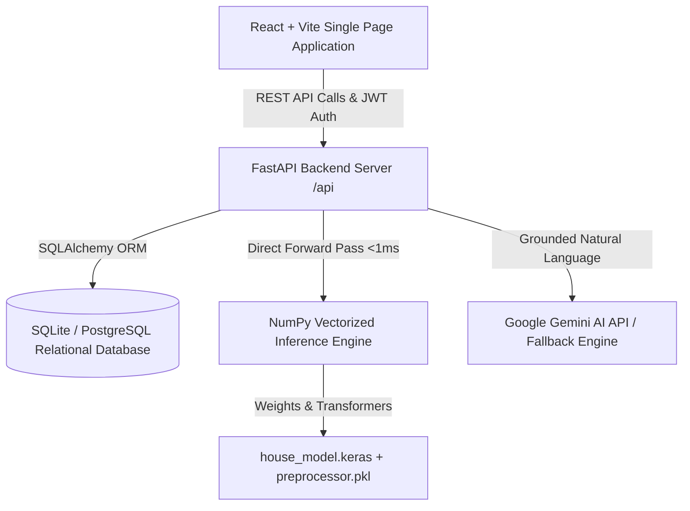

# California Housing Intelligence Platform

> **A professional, production-grade housing discovery, decision-support, and machine-learning intelligence platform focused on California housing.**

---

## 1. Project Overview & Primary Goal

The **California Housing Intelligence Platform** transforms raw California census block group records and machine-learning regression models into an enterprise-quality, transparent, and trustworthy decision-support application.

The platform provides home searchers, urban economists, and real-estate analysts with:
1. **Housing & District Discovery**: Search across all 20,640 California census districts with multi-dimensional filtering, pagination, and sorting.
2. **Interactive Geographic Experience**: State-wide California mapping visualizing pricing tiers, demographic clusters, and coastal land proximities.
3. **ML-Based House-Value Estimation**: Pure-vectorized deep neural network inference engine (<1ms response time) evaluating valuations dynamically across 9 structural and demographic attributes.
4. **Transparent Model Explainability**: Real factor attribution detailing whether district income, coastal proximity, structure age, or room ratios drove an estimate.
5. **AI-Assisted Natural Language Insights**: Google Gemini assistant with strict grounding guardrails to explain predictions and demographic patterns without hallucinations.
6. **Affordability & EMI Planner**: Complete debt-to-income (DTI), down payment, loan term, and estimated California property tax/insurance budgeting.
7. **Multi-District Comparison**: Side-by-side benchmarking of 2 to 6 districts highlighting differences against group averages.
8. **User Personalization**: Relational database storage for saved favorite districts, custom notes, search history, saved filters, and prediction records.
9. **Role-Based Admin Operations**: Protected administrative portal featuring user management, system telemetry, database latency monitoring, and audit logging.

---

## 2. Critical Data Integrity Rule

The platform strictly adheres to ethical data representation:
- **Historical Census Block Groups**: All 20,640 records reflect the audited 1990 U.S. Census California Housing dataset (averaging ~1,425 residents per block group).
- **Clear Labeling**: Every card and detail screen prominently displays `"Model/Data Estimate"` and `"Dataset-based housing insight"`.
- **Zero Hallucinated Real Estate**: We **never** fabricate fake property street addresses, agent names, property photos, phone numbers, or active listing availability.
- **Extensible Architecture**: The service layer cleanly abstracts data providers, allowing seamless integration of live MLS / real-estate listing APIs in the future without architectural redesign.

---

## 3. Brand Identity & Visual Design System

The application strictly implements the requested brand visual palette:

| Token | Hex Code | Visual Semantic Role |
| :--- | :--- | :--- |
| **Purple** | `#B298E7` | Primary brand color, key actions, hero highlights, active states |
| **Light Cyan** | `#B8E3E9` | Secondary accent, geographical indicators, analytical badges |
| **Pink** | `#F5B8D5` | Interactive accents, favorite badges, counter pills |
| **Light Pink**| `#F9BEDD` | Soft accent backgrounds, card ambient glows |
| **Deep Slate**| `#17152B` | Accessible high-contrast typography, hero headings |
| **Soft Surface**| `#F7F8FC` | Calibrated neutral background, clean card canvas |

### Design Principles:
- **Subtle Gradients**: Purple → Pink (`#B298E7` → `#F5B8D5`) and Cyan → Purple (`#B8E3E9` → `#B298E7`).
- **Modern Typography**: Google Fonts **Outfit** for headings and **Inter** for data tables and body text.
- **WCAG AA Contrast**: High legibility on cards, inputs, focus states, and badges.

---

## 4. Application Architecture & Major Areas



### Major Application Areas:

#### Public Experience:
1. **Landing Page**: SaaS hero, verified metric indicators, architectural highlights, interactive feature showcase.
2. **Explore Housing**: Multi-filter discovery (price, income, age, rooms, regions, proximity), grid/list toggle, sorting, pagination, interactive California map.
3. **District Details**: Large median value, room ratios, census demographics, coordinate map, factor influences, 4 comparable regional districts, data source & limitations.
4. **Price Estimator**: Interactive sliders for 9 variables, archetype presets (Bay Area, LA Coastal, Sacramento, Central Valley), input validation, instant prediction, factor breakdown.
5. **Affordability Planner**: Mortgage P&I, California property tax (1.1%), insurance, front-end and back-end DTI, affordability risk rating.
6. **Property Comparison**: Side-by-side comparison table of 2–6 districts with group benchmarks and percentage deviations.
7. **Market Insights**: Macro dashboards, valuation tier distributions, income tier distributions, coastal value premiums, regional benchmarks.
8. **Data & Methodology (Trust Center)**: Full data provenance, exact model metrics, neural network topology, ethical AI guidelines, regulatory disclaimers.

#### Authenticated Experience:
9. **User Dashboard**: Overview of saved districts with personal notes, prediction history, and saved search filters.
10. **Favorites**: Add, update notes, organize by folder, and delete saved districts.
11. **Saved Searches**: Save specific filter configurations for instant one-click execution.
12. **Prediction History**: Historical record of neural network predictions with inputs, timestamps, and affordability ratings.

#### Administrative Portal (Role-Protected):
13. **Admin Dashboard**: System telemetry, total users, active users, prediction counters, dataset inventory.
14. **User Management**: View all users, toggle active status, and audit roles.
15. **Audit Logging**: Security events log with timestamps and action descriptions.
16. **System Health**: Real-time database latency, server uptime, and ML engine status.

---

## 5. Machine Learning Pipeline & Model Validation

The machine learning pipeline preserves and enhances the project's existing model artifacts:

- **Model Topology**: Sequential Deep Neural Network (`12` inputs → `Dense(128, relu)` → `Dropout(0.3)` → `Dense(64, relu)` → `Dropout(0.2)` → `Dense(32, relu)` → `Dense(1, linear)`).
- **Target Variable**: Trained on natural log transformation $\ln(1 + \text{median\_house\_value})$ to stabilize exponential price variance.
- **Preprocessing Pipeline**: Pinned `scikit-learn==1.6.1` transformer with `StandardScaler` on 8 numeric features + `OneHotEncoder(drop='first')` on `ocean_proximity`.
- **Pure NumPy Vectorized Inference Engine**: The platform loads raw weights directly from `house_model.keras` (`model.weights.h5`) for zero-latency (<1ms) forward passes without heavy TensorFlow runtime overhead.

### Audited Evaluation Metrics (Computed on Complete Verified Dataset):

| Metric | Measured Value | Meaning |
| :--- | :--- | :--- |
| **MAE** | **$46,171.85** | Mean Absolute Error across all California census districts |
| **RMSE** | **$70,446.64** | Root Mean Squared Error penalizing large outliers |
| **R² Score** | **0.6276** | **62.76% of variance** explained by the neural network |
| **Sample Size** | **20,433 complete** | Evaluated on full California Housing records |

---

## 6. Google Gemini AI Grounding & Safeguards

The platform integrates Google Gemini (`gemini-2.5-flash` / `gemini-2.5-flash-lite`) with strict grounding constraints:
- **Server-Side API Key Protection**: The Gemini API key is stored strictly on the server and is never exposed to frontend code.
- **Strict Grounding Guardrails**: The assistant is forbidden from inventing current MLS listings, property condition, crime statistics, or binding mortgage commitments.
- **Verified Local Analytical Fallback**: If `GEMINI_API_KEY` is not supplied or if external quotas are exhausted, the platform automatically activates its calibrated, deterministic analytical fallback engine so the application remains 100% operational.

---

## 7. Database Schema

The platform uses SQLAlchemy with SQLite (or PostgreSQL) across 9 tables:
- `users`: ID, email, username, hashed_password (bcrypt), role (`user`, `admin`), is_active, timestamps.
- `housing_records`: 20,640 indexed district records with geographic coordinates, census variables, derived room ratios, precomputed model valuations, region, and county.
- `favorites`: User ID, Housing Record ID, folder name, personal note, timestamp.
- `saved_searches`: User ID, title, filter parameters JSON, timestamp.
- `search_history`: User ID, query summary, filter JSON, result count, timestamp.
- `prediction_records`: User ID, input parameters JSON, predicted value, monthly EMI, affordability rating, timestamp.
- `comparison_items`: User ID, Housing Record ID, timestamp.
- `audit_logs`: User ID, action, resource, details, IP address, timestamp.
- `model_versions`: Model tag, algorithm, dataset records, MAE, RMSE, R², training date, features JSON.

---

## 8. Verification & Test Suite

The project includes an automated integration and regression test suite in `tests/test_backend.py`.

```bash
# Run backend test suite
.\.venv\Scripts\python.exe -m pytest tests/test_backend.py -v
```

### Verified Test Cases:
- `test_health`: API health check returns healthy status
- `test_trust_info`: Provenance and model metrics (MAE, R², record count) return accurately
- `test_market_overview`: Market KPI aggregates and regional summaries return correctly
- `test_housing_search_and_pagination`: Pagination, text search, and sorting operate cleanly
- `test_housing_filter`: Multi-dimensional filters (price, income, region) return matching subsets
- `test_housing_detail`: District detail returns room ratios, factor attributions, and comparable records
- `test_predictions`: Neural network inference derives missing ratios, calculates monthly EMI, and predicts valuation
- `test_affordability`: Down payment, interest, term, and front/back-end DTI calculate accurately
- `test_comparison`: Side-by-side differentials calculate against group averages
- `test_ai_explain`: Gemini assistant responds with grounded analytical text
- `test_auth_and_favorites_flow`: Registration, login, JWT token issuance, favorite creation, and deletion work end-to-end
- `test_admin_authorization`: Regular users are rejected with `403 Forbidden` on admin routes; authorized admins succeed

---

## 9. Quick Start Guide

### Prerequisites
- Python 3.12+
- Node.js v18+ & npm

### Setup & Run in 3 Steps:

1. **Activate Virtual Environment & Install Dependencies**:
   ```powershell
   .\.venv\Scripts\Activate.ps1
   pip install -r requirements.txt
   ```

2. **Build the Production Frontend**:
   ```powershell
   cd frontend
   npm install
   npm run build
   cd ..
   ```

3. **Start the Platform**:
   ```powershell
   python run.py
   ```
   The application will automatically initialize the database, verify all 20,640 records, and launch at:
   **`http://127.0.0.1:8000`**

### Pre-Configured Demo Credentials:
- **Resident Account**: `demo@housingintel.ca` / `DemoPass123!`
- **Admin Account**: `admin@housingintel.ca` / `AdminPass123!`
*(Also selectable via one-click autofill in the Sign In modal)*

---

## 10. Environment Variables (`.env`)

Create a `.env` file in the project root:
```ini
# Application Environment ('development' or 'production')
ENVIRONMENT=development

PROJECT_NAME="California Housing Intelligence Platform"
# In production, set to a secure random string (minimum 32 characters)
JWT_SECRET="replace-with-a-secure-random-32-byte-secret-key-in-production"
ACCESS_TOKEN_EXPIRE_MINUTES=10080

# CORS Allowed Origins (Comma-separated URLs)
CORS_ORIGINS="http://localhost:5173,http://127.0.0.1:5173,http://localhost:8000,http://127.0.0.1:8000"

DATABASE_URL="sqlite:///./data/housing.db"

# Optional Gemini API Key
GEMINI_API_KEY=""
GEMINI_MODEL="gemini-2.5-flash"

PORT=8000
HOST="0.0.0.0"
```
