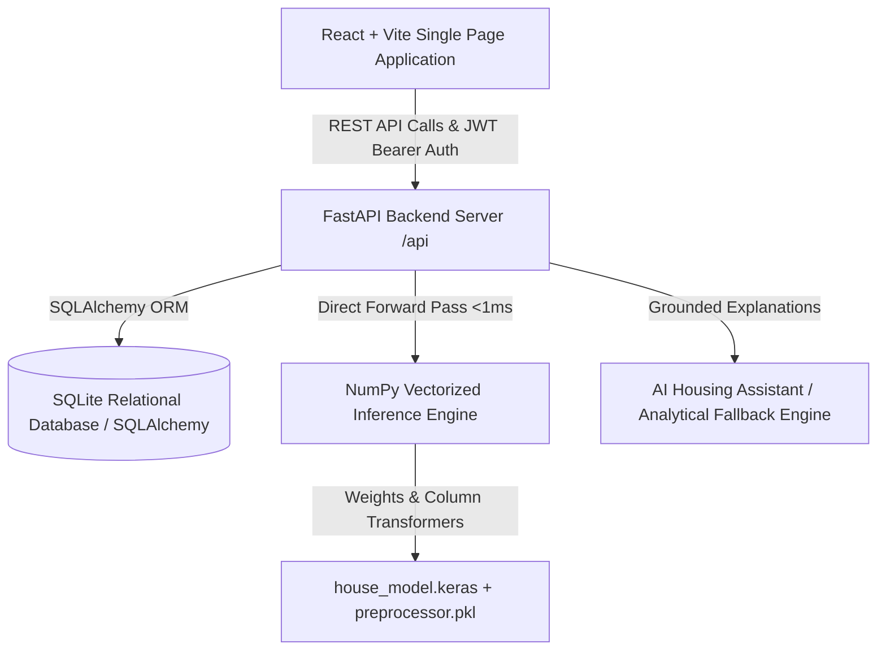

# California Housing Intelligence Platform

> **A full-stack housing intelligence and decision-support web platform built with FastAPI, React, and calibrated machine learning on historical California Census data.**

---

## 1. Project Overview & Primary Purpose

The **California Housing Intelligence Platform** is an analytical decision-support application that enables users to explore historical California demographic patterns, predict housing values using a trained neural network, evaluate mortgage affordability, and benchmark geographic regions.

The platform provides researchers, prospective home buyers, and analysts with:
1. **Housing Record Discovery**: Search and explore 20,640 historical California Census block-group records with multi-dimensional filtering, pagination, sorting, and interactive geographic coordinates.
2. **Interactive Geographic Experience**: Statewide California mapping visualizing estimated values, demographic clusters, and coastal land proximities.
3. **ML-Based Housing Value Estimation**: Vectorized neural network inference engine (<1ms response time) evaluating housing values dynamically across 9 structural, demographic, and geographic attributes.
4. **Transparent Factor Attribution**: Plain-language factor breakdowns detailing how area income, coastal proximity, structure age, and room ratios influence the model's estimate.
5. **AI-Assisted Explanations & Grounding**: A Housing Assistant grounded in the platform's data to explain predictions and demographic dynamics, backed by a deterministic local analytical fallback when external AI services are unconfigured.
6. **Affordability & EMI Planner**: Financial planning tools computing monthly principal & interest (P&I), estimated California property taxes (1.1%), hazard insurance, and front-end/back-end debt-to-income (DTI) budgeting thresholds.
7. **Multi-Record Comparison**: Side-by-side benchmarking of 2 to 6 housing records highlighting differences against group averages.
8. **User Personalization**: Relational database storage for saved favorite records, custom personal notes, search history, saved filter configurations, and prediction history.
9. **Role-Based Admin Operations**: Protected administrative portal featuring user management, system telemetry, database latency monitoring, and audit logging.

---

## 2. Dataset Provenance & Data Integrity Disclaimers

The platform strictly adheres to transparent and ethical data representation:
- **Historical Census Block Groups**: All 20,640 records are derived from the 1990 U.S. Census California block-group dataset (averaging ~1,425 residents per block group).
- **Statistical Model Estimates**: All displayed property values and estimator calculations represent statistical estimates generated by our trained machine-learning model for educational and decision-support purposes.
- **Not Live MLS Listings**: This platform **does not** represent active MLS real-estate listings, homes currently for sale, or commercial transaction appraisals.
- **Zero Fabricated Listings**: The platform never generates fake street addresses, real-estate agent listings, property photographs, or active listing availability.
- **Extensible Architecture**: The service and database layers cleanly decouple data ingestion from business logic, allowing future integration of live MLS or modern real-estate data APIs without redesigning core application interfaces.

---

## 3. Brand Identity & Visual Design System

The application implements a tailored, accessible design system:

| Token | Hex Code | Visual Semantic Role |
| :--- | :--- | :--- |
| **Purple** | `#B298E7` | Primary brand color, primary actions, hero highlights, active states |
| **Light Cyan** | `#B8E3E9` | Secondary accent, geographical indicators, analytical badges |
| **Pink** | `#F5B8D5` | Interactive accents, favorite badges, counter pills |
| **Light Pink**| `#F9BEDD` | Soft accent backgrounds, card ambient glows |
| **Deep Slate**| `#17152B` | Accessible high-contrast typography, hero headings |
| **Soft Surface**| `#F7F8FC` | Calibrated neutral background, clean card canvas |

### Design Principles:
- **Harmonious Gradients**: Purple → Pink (`#B298E7` → `#F5B8D5`) and Cyan → Purple (`#B8E3E9` → `#B298E7`).
- **Modern Typography**: Google Fonts **Outfit** for headings and **Inter** for data tables and body text.
- **Accessible Contrast**: High contrast on cards, inputs, focus states, and badges meeting WCAG AA legibility standards.

---

## 4. Application Architecture



### Major Application Areas:

#### Public Experience:
1. **Landing Page**: Platform overview, verified dataset metrics, architectural highlights, and interactive feature previews.
2. **Explore Housing Data**: Multi-filter discovery (price, income, age, rooms, regions, ocean proximity), grid/list toggle, sorting, pagination, and interactive Leaflet map.
3. **Record Details**: Median housing value, room ratios, census demographics, coordinate map, factor influences, 4 comparable regional records, and data provenance disclaimers.
4. **Price Estimator**: Interactive sliders for 9 variables, archetype presets (Bay Area, LA Coastal, Sacramento, Central Valley), input boundary validation, instant prediction, and factor breakdown.
5. **Affordability Planner**: Mortgage P&I, California property tax, insurance, front-end and back-end DTI, and budgeting guidance.
6. **Record Comparison**: Side-by-side comparison table of 2–6 records with group benchmarks and percentage deviations.
7. **Market Insights**: Macro dashboards, estimated value distributions, income tier distributions, coastal value comparisons, and regional benchmarks.
8. **Data & Methodology (Trust Center)**: Audited dataset provenance, model validation metrics, neural network topology, and AI grounding policies.

#### Authenticated Experience:
9. **User Dashboard**: Overview of saved records with personal notes, prediction history, and saved search filters.
10. **Favorites**: Add, update notes, organize by folder, and delete saved housing records.
11. **Saved Searches**: Save specific filter configurations for instant one-click execution.
12. **Prediction History**: Historical log of neural network predictions with inputs, timestamps, and affordability ratings.

#### Administrative Portal (Role-Protected):
13. **Admin Dashboard**: System telemetry, total users, active users, prediction counters, and dataset inventory.
14. **User Management**: View registered users, toggle active status, and audit assigned roles.
15. **Audit Logging**: Security events log with action descriptions and timestamps.
16. **System Health**: Real-time database latency, server uptime, and ML engine status.

---

## 5. Machine Learning Pipeline & Model Validation

The machine learning pipeline predicts median housing values using a trained deep neural network:

- **Raw Input Features (9 Features)**:
  1. `longitude`: Geographic longitude coordinate
  2. `latitude`: Geographic latitude coordinate
  3. `housing_median_age`: Median age of residential structures
  4. `total_rooms`: Aggregate room count in the block group
  5. `total_bedrooms`: Aggregate bedroom count in the block group
  6. `population`: Resident headcount
  7. `households`: Count of occupied residential units
  8. `median_income`: Median household income (in tens of thousands USD)
  9. `ocean_proximity`: Categorical location (`<1H OCEAN`, `INLAND`, `ISLAND`, `NEAR BAY`, `NEAR OCEAN`)

- **Preprocessing Pipeline**: A serialized Scikit-learn `ColumnTransformer` (`preprocessor.pkl`) standardizes the 8 continuous numeric features with `StandardScaler` and encodes `ocean_proximity` using `OneHotEncoder(drop='first')`, transforming the 9 raw features into a 12-dimensional normalized input vector.
- **Model Topology**: Sequential Deep Neural Network:
  $$\text{Input (12)} \to \text{Dense}(128, \text{ReLU}) \to \text{Dropout}(0.3) \to \text{Dense}(64, \text{ReLU}) \to \text{Dropout}(0.2) \to \text{Dense}(32, \text{ReLU}) \to \text{Dense}(1, \text{Linear})$$
- **Target Variable Transformation**: Trained on natural log transformation $\ln(1 + \text{median\_house\_value})$ (`np.log1p`) to normalize exponential price distributions and stabilize regression gradients. Inference applies `np.expm1` to restore raw dollar valuations.
- **Pure NumPy Vectorized Forward Pass**: The application loads weight matrices directly from the `house_model.keras` zip archive (`model.weights.h5`) using `h5py` and executes forward inference via vectorized NumPy operations ($h = \max(0, XW + b)$). This achieves sub-millisecond (<1ms) inference without the memory footprint or version conflicts of the full TensorFlow runtime.

### Model Evaluation on Project Dataset:

Model evaluation on the complete dataset records (20,433 complete records evaluated):

| Metric | Measured Value | Meaning |
| :--- | :--- | :--- |
| **Coefficient of Determination ($R^2$)** | **0.6276** | **62.76% of variance** explained by the neural network |
| **Mean Absolute Error (MAE)** | **$46,171.85** | Average absolute error across California Census block groups |
| **Root Mean Squared Error (RMSE)** | **$70,446.64** | Quadratic scoring metric penalizing larger deviations |
| **Evaluation Sample** | **20,433 records** | Complete California block groups with verified bedroom data |

---

## 6. AI Explanation, Grounding & Fallback Architecture

The platform features an analytical Housing Assistant designed to explain model estimates:
- **Server-Side API Key Protection**: If configured, the `GEMINI_API_KEY` is loaded strictly on the server and is never exposed to client-side code.
- **Strict Grounding Guardrails**: The assistant is guided by system instructions prohibiting the fabrication of active MLS listings, street addresses, or binding financial advice.
- **Deterministic Analytical Fallback**: When an external API key is unconfigured or external network quotas are exceeded, the platform automatically activates its calibrated local analytical engine. It generates objective, rule-grounded explanations comparing input variables (income, coastal proximity, structure age) against statewide benchmarks.

---

## 7. Database Schema

The platform utilizes SQLAlchemy with SQLite across 9 relational tables:
- `users`: User identity, email, username, salted bcrypt password hash, role (`user`, `admin`), active status, timestamps.
- `housing_records`: 20,640 indexed Census block-group records with geographic coordinates, census variables, derived ratios, precomputed model valuations, region, and county.
- `favorites`: User ID, Housing Record ID, folder name, personal note, timestamps.
- `saved_searches`: User ID, title, filter parameters JSON, timestamps.
- `search_history`: User ID, query summary, filter JSON, result count, timestamps.
- `prediction_records`: User ID, input parameters JSON, predicted value, monthly EMI, affordability rating, timestamps.
- `comparison_items`: User ID, Housing Record ID, timestamps.
- `audit_logs`: User ID, action, resource, details, IP address, timestamps.
- `model_versions`: Model tag, algorithm, dataset records, MAE, RMSE, R², training date, features JSON.

---

## 8. Verification & Test Suite

The project includes automated backend, ML, and browser/UI verification suites:

### 1. Pytest Backend & ML Test Suite (27 Tests):
```powershell
.\.venv\Scripts\python.exe -m pytest tests/test_backend.py tests/test_ml.py -v
```
- **Backend Tests (23 tests)**: API health checks, static asset serving, trust and provenance disclosures, market overview KPIs, multi-dimensional filtering, pagination, record detail attribution, coordinate geo-points, prediction input validation, affordability formulas, comparison logic, AI explain endpoints, authentication registration/login, 401/403 RBAC authorization, and user favorites.
- **ML Tests (4 tests)**: Sensitivity benchmarks comparing coastal vs. inland valuations, Bay Area prediction validation, model metrics integrity, and California geographic bounding box rejection.

### 2. Playwright Headless Chrome Browser Suite (15 Flows):
```powershell
.\.venv\Scripts\python.exe -u tests/browser_verification.py
```
- **Flows A through O**: Landing navigation, search and multi-filtering, detail view, side-by-side comparison matrix, authentication modals, 8-variable ML estimator inference, boundary validation errors, affordability DTI calculations, market insights dashboards, trust and methodology metrics, resident user dashboard, admin 403 access control, admin portal telemetry, AI assistant interaction, user logout, and desktop/mobile responsive viewport checks (375px and 1440px with 0 horizontal overflow).

---

## 9. Quick Start Guide

### Prerequisites
- Python 3.12+
- Node.js v18+ & npm

### Setup & Run in 3 Steps:

1. **Activate Virtual Environment & Install Dependencies**:
   ```powershell
   .\.venv\Scripts\Activate.ps1
   pip install -r requirements.txt
   ```
   *(Note: On Windows PowerShell, if script execution is restricted, run `Set-ExecutionPolicy -Scope Process -ExecutionPolicy Bypass` or execute via `.\.venv\Scripts\python.exe` directly).*

2. **Build the Production Frontend**:
   ```powershell
   cd frontend
   npm.cmd install
   npm.cmd run build
   cd ..
   ```

3. **Start the Platform**:
   ```powershell
   .\.venv\Scripts\python.exe run.py
   ```
   The application will verify database readiness, confirm all 20,640 records, and launch at:
   **`http://127.0.0.1:8000`**

### Pre-Configured Demo Accounts:
- Demo resident and administrator accounts are pre-seeded in the database and accessible through the Sign In modal's one-click quick-fill controls for local demonstration.

---

## 10. Environment Variables (`.env`)

Configure an optional `.env` file in the project root:
```ini
# Application Environment ('development' or 'production')
ENVIRONMENT=development

PROJECT_NAME="California Housing Intelligence Platform"
# In production, set to a secure random string (minimum 32 characters)
JWT_SECRET="replace-with-a-secure-random-32-byte-secret-key-in-production"
ACCESS_TOKEN_EXPIRE_MINUTES=10080

# CORS Allowed Origins (Comma-separated URLs)
CORS_ORIGINS="http://localhost:5173,http://127.0.0.1:5173,http://localhost:8000,http://127.0.0.1:8000"

DATABASE_URL="sqlite:///./data/housing.db"

# Optional Gemini API Key (If omitted, local analytical fallback engine is used)
GEMINI_API_KEY=""
GEMINI_MODEL="gemini-2.5-flash"

PORT=8000
HOST="0.0.0.0"
```

---

## 11. Project Directory Structure

```
├── run.py                          # Application bootstrapper and Uvicorn server runner
├── housing.csv                     # 1990 U.S. Census California housing dataset (20,640 records)
├── house_model.keras               # Serialized neural network weights archive (HDF5)
├── preprocessor.pkl                # Serialized StandardScaler + OneHotEncoder pipeline
├── requirements.txt                # Pinned backend runtime dependencies
├── .env.example                    # Environment variable configuration template
├── .gitignore                      # Git exclusion rules
├── backend/
│   └── app/
│       ├── main.py                 # FastAPI application definition and CORS setup
│       ├── config.py               # Pydantic BaseSettings environment configuration
│       ├── auth.py                 # Bcrypt hashing, JWT generation, and RBAC dependencies
│       ├── schemas.py              # Pydantic request/response validation schemas
│       ├── db/
│       │   ├── database.py         # SQLAlchemy engine and SessionLocal definition
│       │   ├── models.py           # 9 Relational database models
│       │   └── seed.py             # Database initialization and batch record seeding
│       ├── ml/
│       │   └── inference.py        # Vectorized NumPy forward pass and factor attribution
│       └── routers/                # 11 REST API endpoints
├── frontend/
│   ├── index.html                  # HTML entrypoint with typography and Leaflet CSS
│   ├── vite.config.js              # Vite bundler configuration
│   └── src/
│       ├── main.jsx                # React DOM root
│       ├── App.jsx                 # Application layout, navigation, and modal state
│       ├── index.css               # Design system tokens and styling
│       ├── api.js                  # Frontend API client with JWT bearer handling
│       ├── components/             # Navbar, Footer, AuthModal, IntegrityBanner
│       └── pages/                  # 10 Application pages
├── tests/
│   ├── test_backend.py             # 23 Pytest backend integration tests
│   ├── test_ml.py                  # 4 Pytest ML model regression and boundary tests
│   └── browser_verification.py     # Playwright E2E suite covering 15 browser flows
└── archive/
    └── legacy_streamlit/           # Archived early Streamlit prototype files
```

---

## 12. Regulatory & Educational Disclaimer

This application is built for research, statistical benchmarking, and decision-support purposes. All valuations, mortgage EMI approximations, property tax calculations, and debt-to-income assessments are educational estimates based on historical 1990 Census data and statistical modeling. This platform does not provide formal real-estate appraisals, financial underwriting, credit applications, or binding loan commitments.

